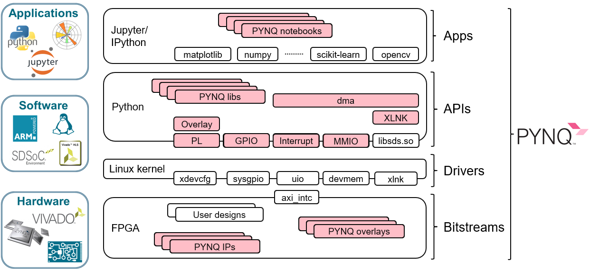

# 02\_PYNQ常见问题

## 什么是PYNQ？

PYNQ是Python On Zynq的缩写，它是一个软件开发框架，指导硬件层、驱动层和应用层之间的接口设计，不是ISE、Vivado、SDSoC这样的IDE工具，更不是Zynq芯片的下一代芯片产品。

PYNQ框架的设计初衷是通过高层次的封装，将底层硬件FPGA实现细节与上层应用层的使用脱耦，对软件开发者来说，PYNQ框架已经提供了完整的访问FPGA资源的library，让上层应用开发者通过Python编程就可以调用FPGA模块，不需要懂Verilog/VHDL硬件编程就可以享受FPGA可并行计算、接口可方便扩展和可灵活配置带来的诸多好处。

在在PYNQ框架下，ARM A9 CPU上运行的软件包括：

· 载有Jupyter Notebooks设计环境的网络服务器

· IPython内核和程序包

· Linux

· FPGA的基本硬件库和API

## PYNQ就是通过Python语言直接对FPGA进行编程吗？

我相信这个问题应该是很多人第一次听说PYNQ框架的印象，事实上，在PYNQ框架下并不能通过Python对FPGA进行编程来取代传统的RTL编程方式。PYNQ框架是为软件开发者提供了访问FPGA资源的python接口，Python开发者可以忽略这些实现细节，通过python即可轻松访问FPGA，动态加载各种预编译好的各种FPGA应用，像调用函数一样去调用各种通过FPGA加速的应用或者访问连接到FPFA的外设。让软件工程师能轻松享受FPGA并行计算和可灵活配置的诸多好处。

## PYNQ和PYNQ-Z2是一回事吗？

PYNQ是一个软件框架，而PYNQ-Z2是支持PYNQ软件框架的硬件板卡，除了PYNQ-Z2，目前官方支持PYNQ框架的板卡还有ZCU104和PYNQ-Z1，只需要下载好已经编译好的PYNQ镜像，开机启动即可开始你的PYNQ之旅。目前其它的板卡也开始支持PYNQ框架了，比如Ultra96等。当然，用户也可以将PYNQ软件框架移植到自己的板卡上，不过对开发者会有更高的要求，需要了解更多的硬件知识。

## PYNQ-Z2是否支持传统开发方式？

除了支持PYNQ框架，PYNQ-Z2也可以采用传统的ZYNQ开发方式，使用Vivado, SDK, SDSoC等工具进行开发。

## 要到哪里学习PYNQ知识呢？

Pynq.io是PYNQ官方网站，上面有英文资源汇总。

另外也欢迎关注PYNQ微信服务号，会不定期发布参考资料、PYNQ应用案例更新。

