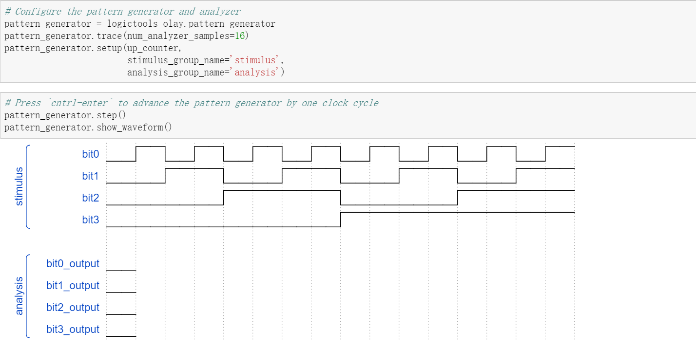

# 06\_Logictools Overlay

Logictools overlay 包含了可编程逻辑硬件区块来与外部数字逻辑电路连接。Python可以做出有限状态机（Finite State Machine）、布尔型逻辑函数和数字模式。一个可编程开关连接了硬件区和外部IO引脚之间的输入和输出。Logictools overlay也可以通过追踪分析器（trace analyzer）来捕捉IO接口传来的数据，方便我们分析调试。

Logictools IP包含了4个主要硬件区块

* 模式生成器
* FSM生成器（有限状态机生成器）
* 布尔型生成器
* 跟踪分析器

每一个区块不需要汇编配置文件，这意味着一个配置可以直接加载到生成器里并立即执行。

## PYNQ-Z2 logic tools

PYNQ-Z2 logictools overlay有两个logictools逻辑控制处理器（LCP），一个与Arduino header连接，一个与RPI header连接。

Arduino header有20个引脚，RPI有26个引脚，他们可以用作为LCP的GPIO。

板上的4个LED和4个按钮可以连接到任意一个LCP上，使得扩展输入成为了可能。注意！LED和按钮是共享的，在一个时刻只能被一个LCP使用。

## 布尔型生成器

与BaseOverlay不一样，我们要用LogicToolsOverlay来导入对应的logictools.bit。所谓布尔型生成器，就是用与、或、异或、非来构成最终的布尔型输出。在代码里，我们用“&”、“\|”、“^”、“~”来分别代表上面四个运算。接下来，我们先构建一个简单的表达式： 。LD2为班上的一个LED，PB3/0为板上的两个按钮。这里我们的运算就是PB3和PB0做异或运算后，把1/0赋值给LD2进行输出。

从bit文件转换出的logictools\_olay类里，我们可以找到布尔型生成器，用其初始化一个布尔型生成器出来，并用上面的表达式配置该生成器，随后用run来运行。

这时候，我们可以按动板上的PB0/3并观察LD2，发现确实是按照异或法则进行的。

调用stop函数即可停止生成器运作。

刚刚，我们使用列表存储了一个表达式，事实上，我们可以使用可读性更高的字典来存储表达式，并且我们可以存储不止一个。

 在上面的代码中，我们除了存储了异或门，还增加了一个与门。 \#\# 模式生成器 接下来我们展示一下如何操作模式生成器的单步模式。需要注意，并不是所有的logictool库中生成器都是单步的。 在这个例子里，我们只用python代码来模拟电路，并用追踪生成器捕捉到的波形来验证我们的结果。

首先，我们导入logictools overlay，并通过代码形式模拟波形。波形的构造满足一定格式。用{‘signal’:\[\]}来表明输入的信号波形。在\[\]内，我们逐一添加波形信息。格式为：{‘name’:’_’, ’pin’:’_’, ‘wave’:’lh.’}其中l代表low波，h表示high波，‘.’表示重复前面波形。

然后我们用logictools里的Waveform来将上述格式的信息转换为板能识别的波形。

接下来，我们按照上图代码为我们的模拟内容增加一点东西。外层的{‘signal’:\[\]}框架不变，在\[\]里，我们将之前的4个模拟波形信号用列表的方式打包，并命名为‘stimulus’（列表的第一个元素为名称），以同样的格式增加一栏‘analysis’。输出的效果如图所示。Analysis栏并没有任何输出，这是因为我们还未用模式生成器来追踪它。Waveform函数只是一个把代码转换成模拟波形并输出的函数而已，不具备追踪功能。

按照上图代码，我们生成一个模式生成器，其创建方式与布尔型生成器一模一样。在配置setup的时候，我们传入之前我们自己写的波形数据，并把模拟信号和分析内容指示给他。随后，我们调用模式生成器的step函数，即可跟踪模拟信号。重复运行step函数，我们可以看到，analysis栏波形按照上面stimulus栏的波形进行输出。

最后，在使用完后，使用reset进行重制。

## FSM生成器

最后，我们用FSM生成器来生成一个FSM（有限状态机）。这个例子中，我们做出来的FSM是一个格雷码计数器，它有三个状态位并可以通过8（即23）个状态来计数。计数器的输出是用格雷码编写的，这意味状态之间的转换只有一个2进制位会被改动（这是格雷码的特性）。

自然，我们先写入logictools.bit。

然后，我们编写相应的状态位。（下面的例子是Z1板上的，Z2板上并没有D0之类的接口）

可以看出，要配置一个状态机，我们所需要描绘其输入、输出、状态、状态变换规则。这些均采用FSM规范格式。

随后，使用logictools里的FSM生成器创建一个，并用上面的对该状态机进行配置。

通过show\_state\_diagram\(\)函数，该状态机会返回一个我们所定义的状态机逻辑图，如下图所示。

为了能看到我们所写的结果，我们需要根据之前的input那一栏把D0与GND连接（逻辑归0），把D1连接到3.3V接口（逻辑归1），这些接口在Arduino区域可以找到。

* The reset input is connected to pin D0 of the Arduino connector
* * Connect       the reset input to GND for normal operation
  * When       the reset input is set to logic 1 \(3.3V\), the counter resets to state 000
* The direction input is connected to pin D1 of the Arduino connector
* * When       the direction is set to logic 0, the counter counts down
  * Conversely,       when the direction input is set to logic 1, the counter counts up

使用run命令来运行我们生成的状态机。

最后用stop命令来完成善后工作。

